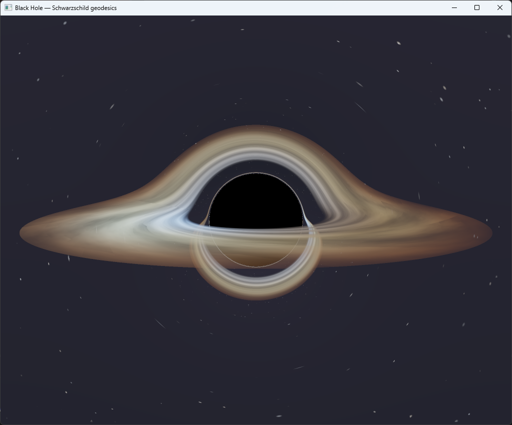

# Black Hole — Schwarzschild Geodesic Ray-Marcher

A real-time, physically-based black-hole renderer written from scratch in Rust
with raw OpenGL (`glow`). Every pixel traces a photon *backwards* along its bent
path through the curved spacetime around a Schwarzschild black hole. The result
is the now-iconic look: a black shadow ringed by a photon ring, with the
accretion disk lensed up and over the top and under the bottom of the hole — the
far side of the disk folded into view by gravity.

## Screenshot
  

## What it does

- **Gravitational lensing.** Light bending is computed by integrating the null
  geodesic, reduced to a central acceleration `a = -1.5 · h² · r / |r|⁵` (with
  the Schwarzschild radius `r_s = 1`), where `h² = |r × v|²` is the conserved
  angular momentum. Background stars are warped around the hole and the disk
  wraps over itself.
- **Photon ring & shadow.** Rays whose impact parameter drops below the critical
  `b_crit = 3√3/2 · r_s ≈ 2.598` fall through the horizon and return black,
  producing the shadow and the bright ring of nearly-trapped light around it.
- **Accretion disk** from the innermost stable circular orbit (`r = 3 r_s`)
  outward, with procedural turbulence, a temperature gradient (blue-white inner,
  orange rim) and Keplerian rotation.
- **Relativistic effects on the disk:** Doppler beaming and blue/redshift from
  the orbital motion (the side rotating toward you is brighter and bluer — the
  signature asymmetry) plus gravitational redshift dimming near the horizon.
- **Relativistic polar jets.** Two optically-thin synchrotron-emitting conical
  outflows are integrated volumetrically along the same bent photon path. The
  approaching jet is Doppler-boosted, the counter-jet is dimmed, and both are
  gravitationally redshifted near the hole.
- **One pass, no geometry.** The whole image is a single fullscreen triangle; the
  fragment shader does all the work. No meshes, no textures, no math crate.

## Build & run

The viewer needs the `render` feature (pulls `winit` / `glutin` / `glow`):

```
cargo run --release --features render
```

The headless validator needs no GPU and no GL:

```
cargo run --release --bin verify          # prints GR checks, writes /tmp/bh.ppm
```

A recent Rust toolchain is recommended (the GL stack uses winit 0.29 / glutin
0.31). Edition 2021. Run the viewer on a machine with real GPU drivers
(OpenGL 3.3+); it will not work over Remote Desktop.

## Controls

| Input | Action |
| --- | --- |
| Left-drag | Orbit the camera |
| Mouse wheel | Zoom |
| `Space` | Pause / resume disk rotation |
| `Up` / `Down` | Ray-march steps — quality vs. speed |
| `R` | Reset view |
| `Esc` | Quit |

If it runs slowly, drop the step count with `Down` (default 400). A discrete GPU
handles 600–900 comfortably; lensing quality near the ring improves with steps.

## How it works

A photon is integrated backwards from the eye. At each step the ray feels the
central acceleration above, so straight lines curve near the hole. Three things
can end a ray:

1. it crosses the horizon (`r < r_s`) and is swallowed → black;
2. it escapes to infinity → sample the procedural starfield/nebula along the
   final (bent) direction;
3. it crosses the equatorial plane inside the disk annulus → accumulate disk
   emission (with partial transparency, so the lensed far side shows through).

The disk colour combines a radial temperature gradient, procedural turbulence
that rotates differentially (Kepler), gravitational redshift `√(1 − r_s/r)` and a
relativistic Doppler factor `δ = 1 / (γ(1 − β·μ))` with beaming `∝ δ³`. The step
size is adaptive — small near the hole where the path curves hard, larger far
away.

## Relativistic jet model

The polar jets are deliberately more than a decorative overlay. They are sampled
inside the ray-march loop, so the same Schwarzschild geodesic that bends the
disk and background also passes through the jet volume. This means the apparent
shape changes naturally with camera angle and lensing near the hole.

The model is still a compact real-time approximation, not a full GRMHD
simulation. The assumptions are explicit:

- the black hole is kept Schwarzschild (`r_s = 1`), so the jet axis is imposed as
  a fixed visual spin axis rather than derived from a Kerr metric;
- each jet is a transparent cone along `+Y` / `-Y`, launched just outside the
  horizon and fading with height;
- the plasma has a spine/sheath density profile plus procedural knots and shock
  bands to avoid a sterile smooth cone;
- the bulk flow moves outward with `β = v/c`, accelerating from about `0.55c`
  near the base to about `0.94c` farther out;
- observed emission uses the same Doppler factor form
  `δ = 1 / (γ(1 − β μ))`, where `μ` is the cosine between the local outflow
  direction and the direction to the camera;
- synchrotron-like optically-thin intensity is boosted approximately as
  `δ^(3+α)` with spectral index `α ≈ 0.65`;
- gravitational redshift is approximated by `g_grav = √(1 − r_s/r)`, so emission
  from the compact base is dimmed and reddened;
- the final colour shift uses `g = g_grav · δ`, so the approaching jet becomes
  brighter/bluer and the receding jet becomes dimmer/redder.

In code this lives in `jetSample()` in `src/render.rs` and `jet_sample()` in
`src/blackhole.rs`. During each ray step the renderer adds a small amount of
jet emission and opacity before advancing the photon. The jets are mostly
transparent; opacity is only used to give the dense base some self-occlusion and
to stop infinite accumulation.

Important limitation: because the spacetime is Schwarzschild, this does not
model frame dragging, black-hole spin, Blandford-Znajek launching, magnetic
fields, polarization, or real radiative transfer. A physically deeper version
would need a Kerr geodesic integrator plus GRMHD-derived density, velocity and
magnetic-field data. This implementation is a visually serious relativistic
jet approximation that fits the current single-pass real-time renderer.

## Verification

The renderer's core is validated headless (`src/blackhole.rs` + `src/bin/verify.rs`),
which matters because the shader itself can't be unit-tested:

- **Light deflection vs General Relativity.** The measured bending angle for a
  ray of impact parameter `b` is compared against Einstein's `2 r_s / b`. The
  ratio tends to 1 for large `b` (weak field) and grows for small `b` (strong
  field) — exactly as GR predicts — which confirms the geodesic constant.
- **Photon capture.** Rays below `b_crit ≈ 2.598 r_s` are swallowed; rays above
  it escape.
- **Reference image.** `verify` renders a frame with the *same* maths as the
  shader to a PPM, so the lensing and disk can be eyeballed without a GPU.

The GLSL fragment shader in `src/render.rs` is a line-by-line mirror of the
validated Rust in `src/blackhole.rs`.

## Tuning

In `src/blackhole.rs` / the shader: `DISK_IN` / `DISK_OUT` (disk extent),
the temperature colours, the `1.4` disk emission gain, and the Doppler `β` cap.
For jets, tune the cone opening angle, launch/fade heights, terminal `β`,
spectral index `alphaSpec`, emission gain `0.105`, and optical-depth scale
`0.040`. In `src/camera.rs`: starting distance and field of view. Camera pitch
near the disk plane gives the most dramatic lensing; elevated angles show the
jet/counter-jet asymmetry more clearly.

## Layout

```
src/
  math.rs        Vec3 (no math crate)
  camera.rs      orbit camera -> eye + ray basis
  blackhole.rs   geodesic integrator + disk + starfield (CPU reference)
  render.rs      glow renderer + the GLSL raymarch shader
  app.rs         window, GL context, main loop
  main.rs        entry point (dispatches to the viewer)
  bin/verify.rs  headless GR checks + reference render
```

## Technical notes

- **Raw OpenGL via `glow`** — window/context through `winit` + `glutin`; the
  render is a single fullscreen-triangle fragment shader. No engine.
- **No math/physics/render crates.** Vector maths, the geodesic integrator and
  all shading are hand-written.
- **Rust**, edition 2021.

## License

See `LICENSE`.

## Support

If you found this project interesting or useful, you can support my work:

[](https://github.com/sponsors/makarov-mm)